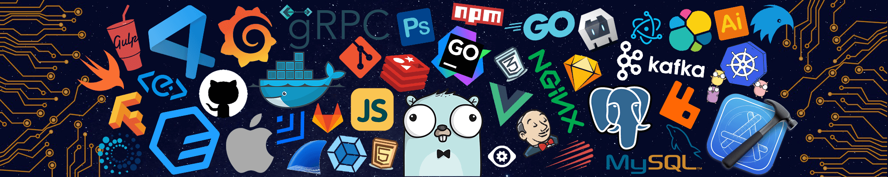

<!--   my-icons -->

    
    
    
    
       

<!--   my-header-img -->

<!--   my-ticker -->

 
## 🛠️ Stack & Ferramentas
 
| Categoria | Tecnologias |
|-----------|-------------|
| **💻 Linguagens** |         |
| **🖥️ IDEs** |     |
| **⚙️ Back-End Frameworks** |  |
| **🎨 Front-End** |      |
| **🗄️ Bancos de Dados** |   |
| **☁️ Cloud & Deploy** |    |
| **🐳 Containers & Infra** |    |
| **📊 Monitoramento** |   |
| **🤖 Machine Learning** |   |
| **🔧 Controle de Versão** |   |
 
---

<!--   Profile Summary -->

<!--   GitHub Stats -->

 
    
    

<!--   GitHub Streak -->

## 🔗 Links

Trophy: Github Profile Trophy

 

---
  *Se você gostou do meu perfil, dê um Star ⭐ no repositório! Ou dê ideias ou opinião.* 
---
Se você quiser contribuir com qualquer um dos meus repositórios, será bem-vindo(a)! Estou sempre aberto(a) a novas ideias e colaborações.
---
  *Fique à vontade para entrar em contato comigo para perguntas, sugestões. Juntos podemos construir algo incrível! 🚀* 
---

